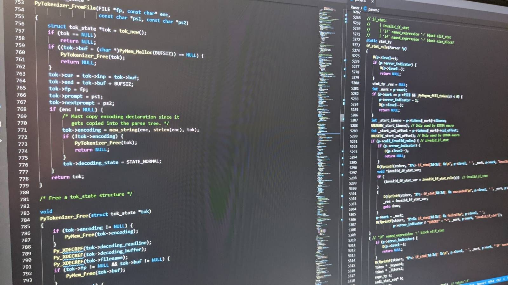
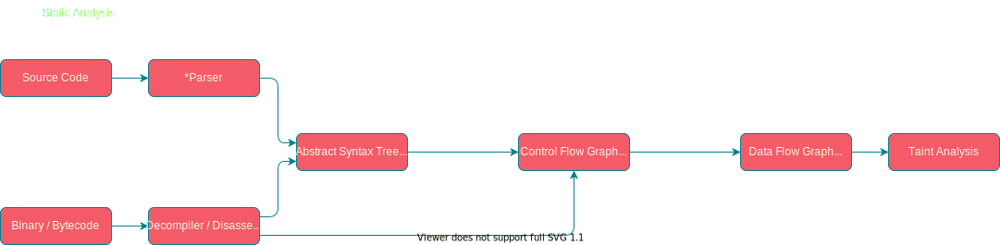
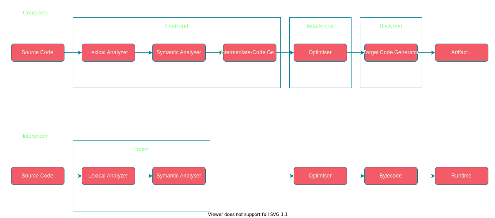
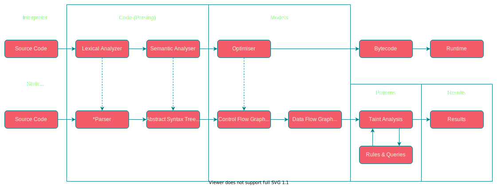
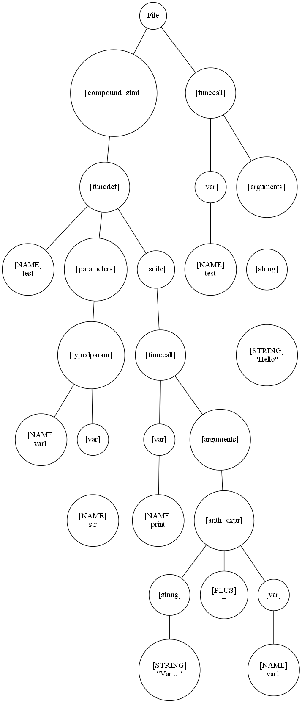
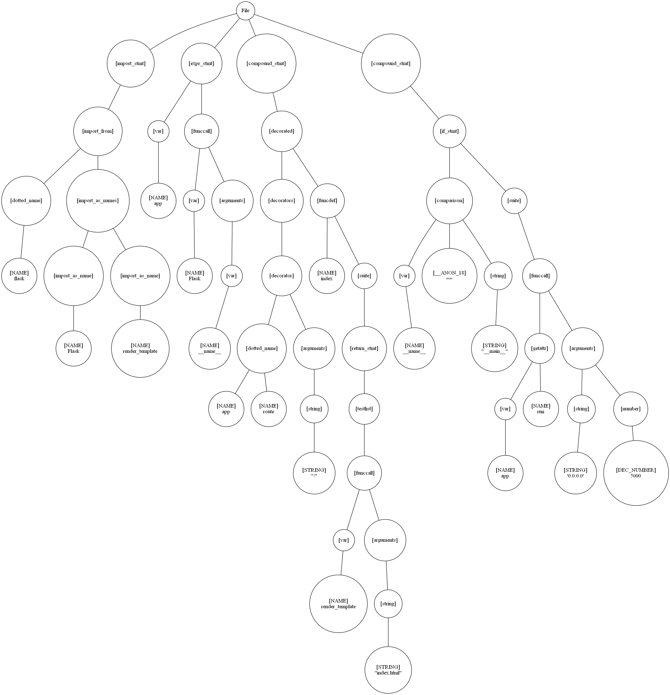
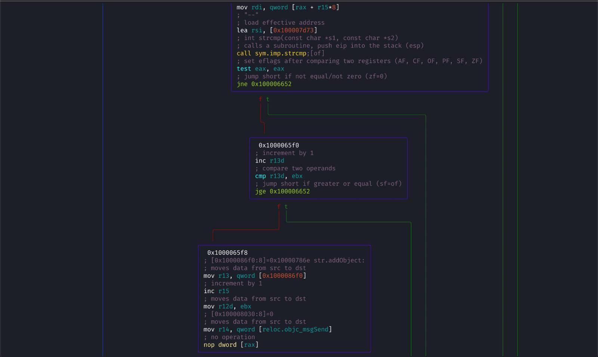
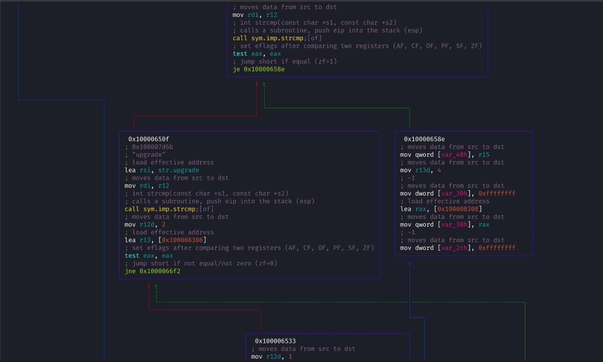
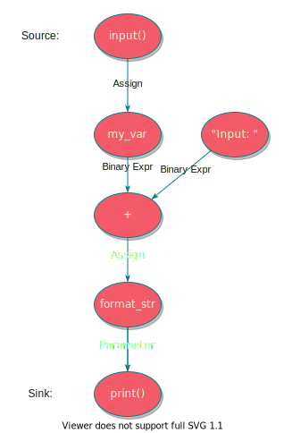

# Introduction to Static Code Analysis

**By Mathew Payne - @GeekMasher**



<!--
**Title:**
> Introduction to Static Code Analysis

**Description:**
> This talk will give an introduction into what static code analysis is, go into a deeper dive into how it's done today, and finally discuss the impact & complications around using static analysis.


**Slides:**
https://presentations.geekmasher.dev/2021-09-Defcon44131
-->
---

!include(./presentations/common/whoami.md)

---
# Today's Talk

- What is Static Code Analysis?
- How does Static Code Analysis work?
- Examples of how this is done
- What are the Pros and Cons of static Analysis?


---
# What is Static Code Analysis?

*OWASP Definition:*

> Static Code Analysis (also known as Source Code Analysis) is usually performed as part of a Code Review (also known as white-box testing) and is carried out at the Implementation phase of a Security Development Lifecycle (SDL).
>
> Static Code Analysis commonly refers to the running of Static Code Analysis tools that attempt to highlight possible vulnerabilities within 'static' (non-running) source code by using techniques such as Taint Analysis and Data Flow Analysis.

---
# What is Static Code Analysis?

- An automated tool to analyse code and answer questions
  - Generally in security but also quality and other fields
  - "Does this parameter get used in a SQL query correctly?"
- Discover repetitive security issues
- Looks at the code without running the code
  - No need to deploy or run an application like it would in production

<!-- 
Source: https://owasp.org/www-community/controls/Static_Code_Analysis
-->
---
# Types of Static Analysis Tools

- **Source Code Analysis**
  - Parsers source code directly
  - Some tools use a compiler and requires build-able code

- **Binary / Bytecode Analysis**
  - Decompile and Disassemble code

<!--
This is not a full list but a generalist list that I have
-->

---
# How is Static Code Analysis done?

**Four Core Part of an Analysis**

- Abstract Syntax Tree (AST)
- Control	Flow Graph (CFG)
- Data Flow Graph (DFG)
- Taint Analysis

<!--
- Break down all these parts
  - For the first part, lets talk about compilers
-->
---
<!-- _class: lead -->
# Static Code Analysis Pipelines



**Well, some of these terms might seem familiar...**

---
<!-- _class: lead -->
<!-- _footer: '*Overly simplified and different languages might look different' -->
# Compiler and Interpreter Pipelines




---
<!-- _class: lead -->
## So how do Static Code Analysis tools do it?



<!--
All of these locations you can build a static code analysis tools
-->
---
## Abstract Syntax Tree (AST)

- Built from source code / compilers using:
  - Lexical Analyser
  - Symantic Analyser

- Built from binaries / bytecode using:
  - Decompilers
  - Disassemblers

<!--

**Resources:**
- https://www.tutorialspoint.com/compiler_design/compiler_design_syntax_analysis.htm

-->
---
<!-- _class: lead -->
<!-- _footer: Using Lark + PyDot -->
#### Example 1: Abstract Syntax Tree 

```python
# Test function
def test(var1: str):
    print("Var :: " + var1)

test("Hello")
```



---
<!-- _class: lead -->
<!-- _footer: Using Lark + PyDot -->
#### Example 2: Abstract Syntax Tree 

```python
from flask import Flask, render_template

app = Flask(__name__)

@app.route("/")
def index():
    return render_template("index.html")

if __name__ == "__main__":
    app.run('0.0.0.0', 5000)

```




---
<!-- _footer: Image from Wikipedia -->
## Control Flow Graph (CFG)

- Modeling control flow in the application

- Directional graphs

- Compilers use CFG for optimisations


<!-- TODO: Fix image -->


<!--
Source: https://en.wikipedia.org/wiki/Control-flow_graph

(a) an if-then-else
(b) a while loop
(c) a natural loop with two exits, e.g. while with an if...break in the middle; non-structured but reducible
(d) an irreducible CFG: a loop with two entry points, e.g. goto into a while or for loop
-->
---
<!-- _footer: 'Image(s): Radare2 CFG by @hexploitable' -->
### Showcase - Radare2 CFG


<!--  -->

---
## Data Flow Graph (DFG)

- Data model of a program / application
  - Directional graphs

- No conditionals
  - CFG focuses on the conditions

<!--
- https://codeql.github.com/docs/writing-codeql-queries/about-data-flow-analysis/
- https://www.sciencedirect.com/topics/computer-science/data-flow-graph
-->
---
<!-- _class: lead -->
#### Example - Simple Application + DFG

```python
!include(presentations/2021-09-Defcon44131/samples/python-flow.py)
```




---
# Taint Analysis

- Sources (user controlled inputs)
- Sinks (dangerous methods / assignments)
- Sanitizers (secures the user data)
- Passthroughs (functions that track tainted data)

<!-- TODO: Fix image -->

---
#### Example #X - Detecting Simple Configuration Problems

```python
!include(presentations/2021-09-Defcon44131/samples/flask-debugging.py)
```

*What issue do you see here?*

<!-- 
Simple debugging is enabled
-->

---
#### Example #X - Simple Taint Flow

```python
!include(presentations/2021-09-Defcon44131/samples/flask-sqli.py)
```

*What issue do you see here?*

---
#### Example X - 

```python
from flask import Flask
app = Flask("MyApp")

@app.route("/admin")
@login_required
def index():
    return render_template("admin.html")

@app.route("/admin/settings")
def index():
    return render_template("admin/settings.html")
```

*What issue do you see here?*

<!--
What should be 
-->


<!-- _class: lead -->
# Context is so important!

**But it's so hard to tools to know without us telling them**


---
# Example - Hashing

```python
import hashlib

def hashData(data: str) -> str:
    # using SHA1
    hashobj = hashlib.sha1(data.encode())
    digest = hashobj.hexdigest()
    return digest
```

**Is this insecure?**

---
<!-- _class: lead -->
# Answer: It Depends on context

**Cryptographic functions, Signing, password storage**

*What about Git? Simple file hashing signatures?*

---
# Example - Hashing attempt 2

```python
import hashlib


def hashData(data: str) -> str:
    # using SHA256 now...
    hashobj = hashlib.sha256(data.encode())
    digest = hashobj.hexdigest()
    return digest
```

**Is this insecure?**

---
<!-- _class: lead -->
# Answer: It Depends on context

**Password hashing**

---

```python
password = input()
digest = hashData(password)

```


---
<!-- _class: lead -->
# Conclusion

---
# :thumbsup: The Pros

- Easy to Implement in SDLC
- Can be run as part of the SDLC process
  - IDE, Pull Request, or CICD 

---
# :thumbsdown: The Cons

- Poorly written tools leading to:
  - False Positives
  - False Negatives (un-discovered true findings)
- Not aware of context
- Need to know all your sources, sinks, and Sanitizers
  - Every framework, library, and module :eyes:


---
# Thanks to...


---
# References

- [How does JavaScript and JavaScript engine work in the browser and node?](https://medium.com/jspoint/how-javascript-works-in-browser-and-node-ab7d0d09ac2f)
- [Firing up the Ignition interpreter](https://v8.dev/blog/ignition-interpreter)
- [Carnegie Mellon University - Taint Analysis](https://www.cs.cmu.edu/~ckaestne/15313/2018/20181023-taint-analysis.pdf)
- [Northwestern - Static Analysis](https://users.cs.northwestern.edu/~ychen/classes/cs450-f16/lectures/10.10_Static%20Analysis.pdf)
