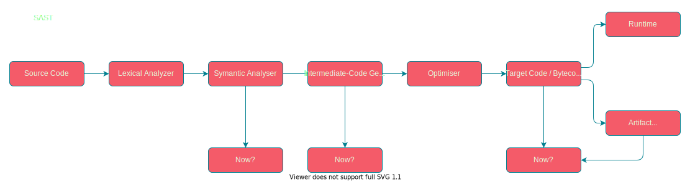

# Introduction to Static Code Analysis

**By Mathew Payne - @GeekMasher**

---

!include(./presentations/common/whoami.md)

---
# Today's Talk

- What is Static Code Analysis?
- How does Static Code Analysis work?
- Examples of how this is done
- What are the Pros and Cons of static Analysis?


---
# What is Static Code Analysis?

*OWASP Definition:*

> Static Code Analysis (also known as Source Code Analysis) is usually performed as part of a Code Review (also known as white-box testing) and is carried out at the Implementation phase of a Security Development Lifecycle (SDL).
>
> Static Code Analysis commonly refers to the running of Static Code Analysis tools that attempt to highlight possible vulnerabilities within 'static' (non-running) source code by using techniques such as Taint Analysis and Data Flow Analysis.

---
# What is Static Code Analysis?

- An automated tool to analyse code and answer questions
  - Generally in security but also quality and other fields
  - "Does this parameter get used in a SQL query correctly?"
- Discover repetitive security issues
- Looks at the code without running the code
  - No need to deploy or run an application like it would in production


---
# How is Static Code Analysis done?

- Parsers and Parse trees
- Abstract Syntax Tress (AST)
- Control	Flow Graph (CFG)
- Dataflow Analysis
- Taint Analysis

**Well, some of these terms might seem familiar...**

<!--
- Big words in this slide
- Break down all these parts
  - For the first part, lets talk about compilers
-->

---
<!-- _class: lead -->
<!-- footer: '*Overly simplified and different languages might look different' -->
# Compiler and Interpreter Pipelines


---
<!-- _class: lead -->
<!-- footer: '' -->
## So how do Static Code Analysis tools do it?



**Which is the right place?**


---
# Types of Static Analysis Tools

- Source Code Analysis
  - Parsers source code directly 
- Build time Analysis
  - Parser source code as the compiler would
- Binary / Bytecode Analysis
  - Decompile and Disassemble code

<!--
This is not a full list but a generalist list that I have
-->


---
# Core Static Analysis Parts

- Sources (user controlled inputs)
- Sinks (dangerous method)
- Sanitizers (secures the user data)
- Passthroughs (functions that track tainted data)


---
# Simple Application and Dataflow

<!-- _class: lead -->

```python
!include(presentations/2021-09-Defcon44131/samples/python-flow.py)
```


---
#### Example #X - Detecting Simple Configuration Problems

```python
!include(presentations/2021-09-Defcon44131/samples/flask-debugging.py)
```

*What issue do you see here?*

<!-- 
Simple debugging is enabled
-->

---
#### Example #X - Data Flow

```python
!include(presentations/2021-09-Defcon44131/samples/flask-sqli.py)
```

*What issue do you see here?*

---
#### Example X - 

```python
from flask import Flask
app = Flask("MyApp")

@app.route("/admin")
@login_required
def index():
    return render_template("admin.html")

@app.route("/admin/settings")
def index():
    return render_template("admin/settings.html")
```

*What issue do you see here?*

<!--
What should be 
-->

---
# Conclusion


---
# :thumbsup: The Pros

- Easy to Implement
- Can be run as part of the SDLC process
  - IDE, Pull Request, or CICD 

---
# :thumbsdown: The Cons

- Poorly written tools leading to:
  - False Positives
  - False Negatives (un-discovered true findings)
- Not aware of context
- Need to know all your sources, sinks, and Sanitizers
  - Every framework, library, and module :eyes:


---
# References

- [How does JavaScript and JavaScript engine work in the browser and node?](https://medium.com/jspoint/how-javascript-works-in-browser-and-node-ab7d0d09ac2f)
- [Firing up the Ignition interpreter](https://v8.dev/blog/ignition-interpreter)
- [Carnegie Mellon University - Taint Analysis](https://www.cs.cmu.edu/~ckaestne/15313/2018/20181023-taint-analysis.pdf)
- [Northwestern - Static Analysis](https://users.cs.northwestern.edu/~ychen/classes/cs450-f16/lectures/10.10_Static%20Analysis.pdf)
