# Introduction to Static Code Analysis

**By Mathew Payne - @GeekMasher**

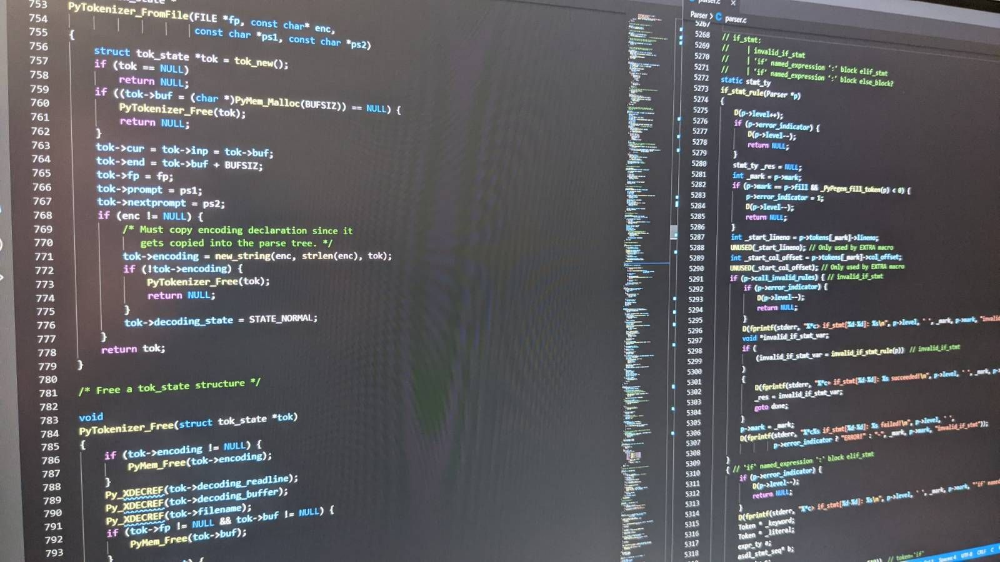

<!--
**Title:**
> Introduction to Static Code Analysis

**Description:**
> This talk will give an introduction into what static code analysis is, go into a deeper dive into how it's done today, and finally discuss the impact & complications around using static analysis.


**Slides:**
https://presentations.geekmasher.dev/2021-09-Defcon44131
-->
---

!include(./presentations/common/whoami.md)

---
# Today's Talk

- Introduction to to Static Code Analysis
- Deeper dive into how does Static Code Analysis work?
- Examples of how this is done
- Summary and Thoughts on using Static Code Analysis
  - Pros and Cons


---
# What is Static Code Analysis?

*OWASP Definition:*

> Static Code Analysis (also known as Source Code Analysis) is usually performed as part of a Code Review (also known as white-box testing) and is carried out at the Implementation phase of a Security Development Lifecycle (SDL).
>
> Static Code Analysis commonly refers to the running of Static Code Analysis tools that attempt to highlight possible vulnerabilities within 'static' (non-running) source code by using techniques such as Taint Analysis and Data Flow Analysis.

---
# What is Static Code Analysis?

- :memo: An automated tool to analyse source code
  - Automate Code Review
- :mag: Discover known security issues
- :repeat: Discover repetitive security issues
- :hash: Looks at the code without running the code

<!-- 
Source: https://owasp.org/www-community/controls/Static_Code_Analysis
-->
---
## Automating Source Code Review

- :memo: Applications come in all shapes and sizes
  - :grimacing: From 20 lines to over 100 Million lines!!
- :hourglass: Security Engineers / Researchers only can do some much
  - Generally sandbox and limited time
  - How much code can they review in the time they have?
  - Covering all security patterns?
- :mag: Need to automate the discovery of security issues


*This is where Static Code Analysis comes into play*

---
# Static Analysis Pipeline / Workflow

:memo: Code => :building_construction: Models => :speech_balloon: Patterns => :bookmark_tabs: Results!


---
<!-- TODO: Is there a better name for this I can use? -->
# Models

- :memo: Parse the code
  - :palm_tree: Syntax trees
- :building_construction: Create models of that code
  - :ocean: Flow Graphs
- :eyes: Use the models to look for things we are interested in

---
# Security Patterns

- Two general types
- :beach_umbrella: Using something insecure
  - Configurations / Setting
  - "Is debugging set to True?"

- :mountain: Data flows into somewhere insecure
  - User Input => [some other stuff] => `sql.execute(input)`
  - "Are request parameters get used to build a SQL query?"

<!-- _class: lead -->
*In Static Analysis these are called Rules or Queries*

<!-- TODO: Better word this -->
---
# Results Produced

- :warning: Security Issues
  - SQL Injection, Cross Site Scripting, ...
- :sparkles: Best Practices
  - Using Key Vaults, ...
- :mag_right: Code Quality and Code Smells
  - Long Functions, Duplicated code, ...
- :thumbsup: Positive Results
  - Using appropriate hashing algorithms, automatic encoding, ...

<!-- 
Sources: https://github.com/OWASP/ASVS
-->
---
# :warning: Warning: Here be Dragons :dragon:

<!-- TODO: Dragon image + source -->

---
# Before we begin: Glossary

- Static Code Analysis == Static Application Security Testing (SAST)
  - We are not talking about Software Composition Analysis (SCA)

- Abstract Syntax Tree (AST) != Application Security Testing (AST)

<!-- _class: lead -->
*Confusing I know :confused:*

---
# Static Analysis Pipeline / Workflow

:memo: Code => :building_construction: Models => :speech_balloon: Patterns => :bookmark_tabs: Results!

---
# Types of Static Analysis Tools

- **Source Code Analysis**
  - Input: Source Code
  - Parsers source code directly
  - Some tools use a compiler and requires build-able code

- **Binary / Bytecode Analysis**
  - Input: Binaries
  - Decompile and Disassemble code

<!--
This is not a full list but a generalist list that I have
-->

---
# How is Static Code Analysis done?

**Four Core Parts of an Analysis**

- :palm_tree: Abstract Syntax Tree (AST)
- :ocean: Control	Flow Graph (CFG)
- :compass: Data Flow Graph (DFG)
- :zap: Taint Analysis

<!--
- AST: Tree representation on the Coded parsed
- CFG: Directional Graph of the Control Flows in the Application
- DFG: Directional Graph of the Data flows in an applications
- TA: 
-->
---
# Static Analysis Pipeline / Workflow

:memo: Code :mag: => :building_construction: Models :mag: => :speech_balloon: Patterns => :bookmark_tabs: Results!

---
# Static Code Analysis Parsing

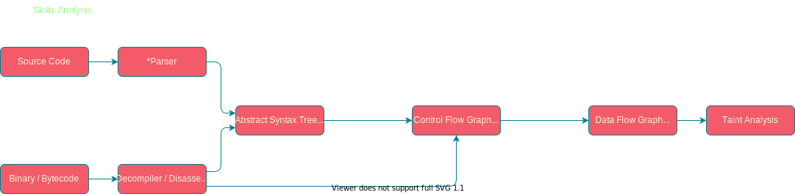

**Well, some of these terms might seem familiar...**

---
<!-- _footer: '*Overly simplified and different languages might look different' -->
# Compiler and Interpreter Pipelines

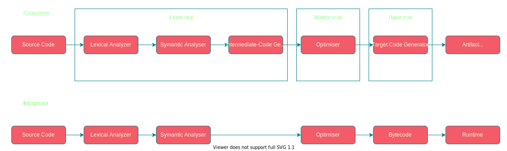


---
## So how do Static Code Analysis tools do it?

:memo: Code => :building_construction: Models => :speech_balloon: Patterns => :bookmark_tabs: Results!

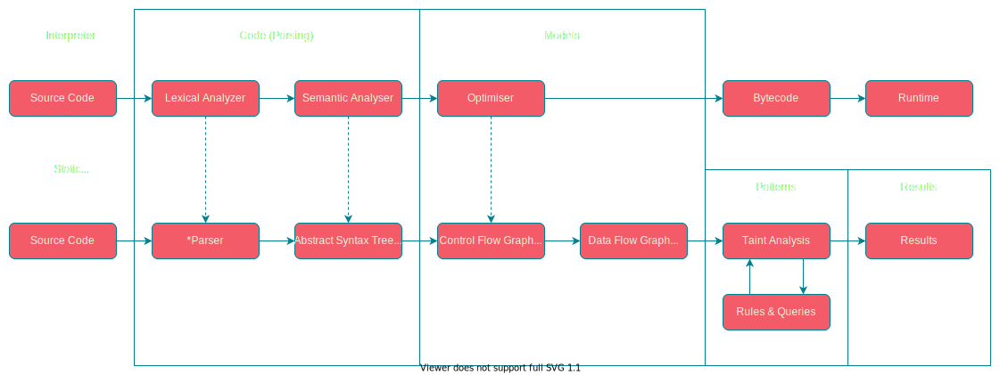

<!--
All of these locations you can build a static code analysis tools
-->
---
## :palm_tree: Abstract Syntax Tree (AST)

- Built from source code / compilers using:
  - Lexical Analyser
  - Semantic Analyser

- Built from binaries / bytecode using:
  - Decompilers
  - Disassemblers

<!--

**Resources:**
- https://www.tutorialspoint.com/compiler_design/compiler_design_syntax_analysis.htm

-->
---
<!-- _footer: Using Lark + PyDot -->
#### Example - Abstract Syntax Tree

```python
# Assignment
v = 1 + 1
```

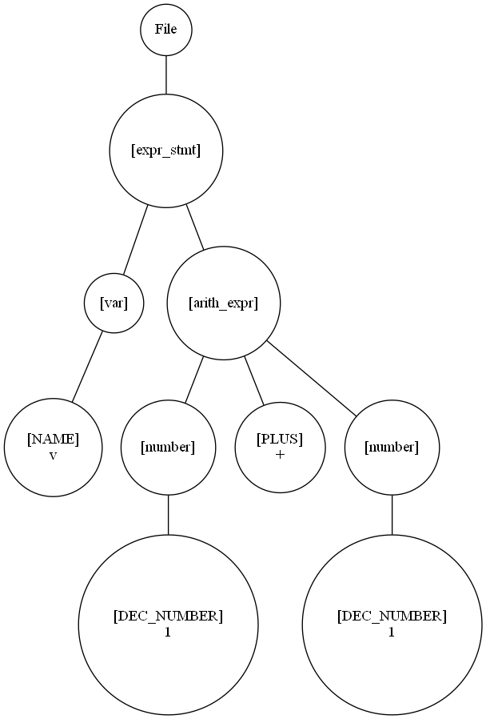

---
<!-- _footer: Using Lark + PyDot -->
#### Example - Abstract Syntax Tree

```python
# Functions
def test(var1: str):
    print("Var :: " + var1)

test("Hello")
```

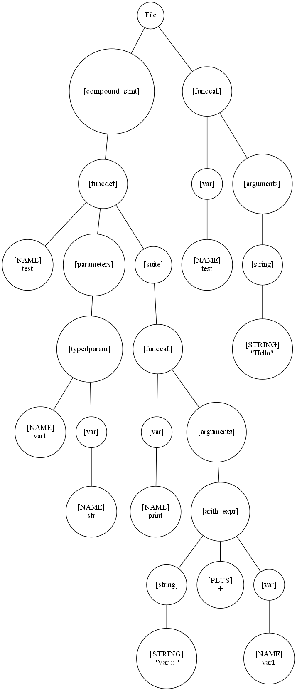

---
<!-- _footer: Using Lark + PyDot -->
<!-- _paginate: False -->
#### Example - Abstract Syntax Tree (web app)

```python
from flask import Flask, render_template

app = Flask(__name__)

@app.route("/")
def index():
    return render_template("index.html")

if __name__ == "__main__":
    app.run('0.0.0.0', 5000)

```

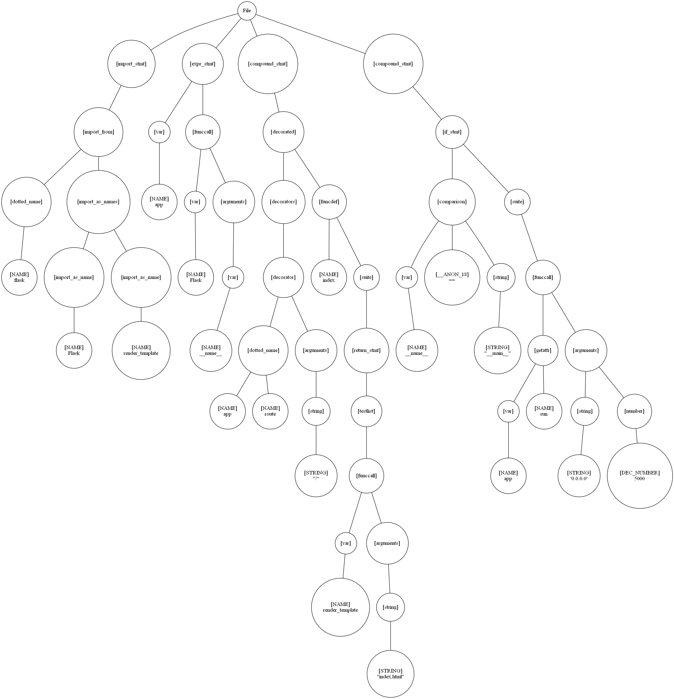


---
<!-- _footer: Image from Wikipedia -->
## :ocean: Control Flow Graph (CFG)

- Modeling control flow in the application

- Directional graphs

- Compilers use CFG for optimisations


<!--
Source: https://en.wikipedia.org/wiki/Control-flow_graph

(a) an if-then-else
(b) a while loop
(c) a natural loop with two exits, e.g. while with an if...break in the middle; non-structured but reducible
(d) an irreducible CFG: a loop with two entry points, e.g. goto into a while or for loop
-->
---
<!-- _footer: By Rahul Gopinath and The Fuzzing Book -->
#### Example - Control Flow Graph

```python
# Control flows
x = 1
while x > 0:
    if x > 1:
        continue
    x = x -1
y = x
```

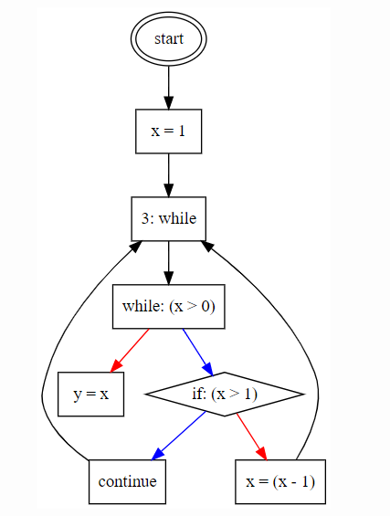

*Blue = True, Red = False*

<!--
Sources:
- https://www.fuzzingbook.org/html/ControlFlow.html
- https://rahul.gopinath.org/post/2019/12/08/python-controlflow/
-->
---
<!-- _class: -->
<!-- _footer: 'Image(s): Radare2 CFG by @hexploitable' -->
### Showcase - Radare2 CFG

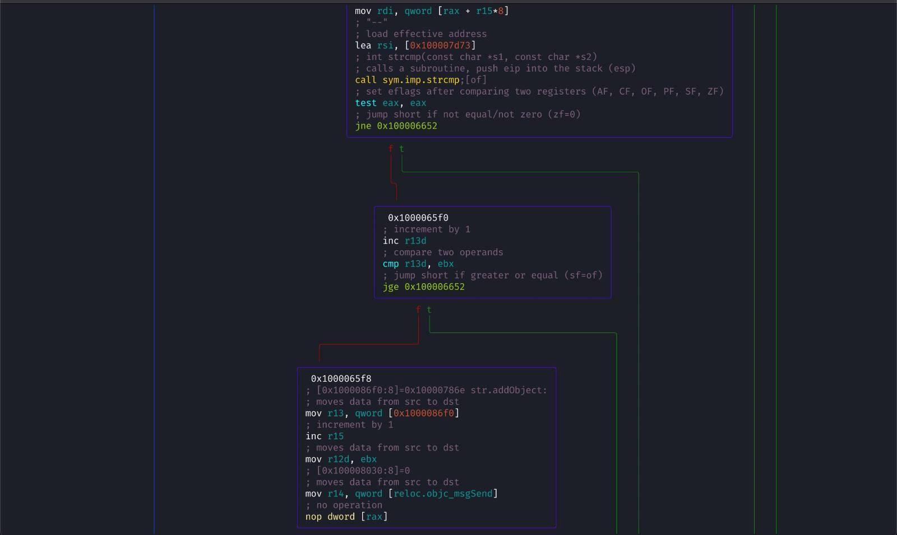
<!-- 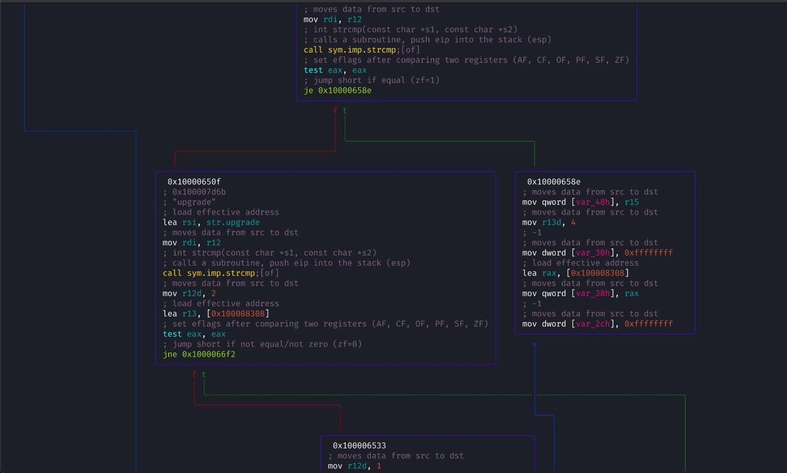 -->

---
## :compass: Data Flow Graph (DFG)

- Typically based on the Control Flow Graph

- Data model of a program / application
  - Directional graphs

- Non conditional
  - CFG focuses on the conditions
  - Can we tightly linked

<!--
- https://codeql.github.com/docs/writing-codeql-queries/about-data-flow-analysis/
- https://www.sciencedirect.com/topics/computer-science/data-flow-graph
-->
---
#### Example - Simple Application + DFG

```python
!include(presentations/2021-09-Defcon44131/samples/python-flow.py)
```

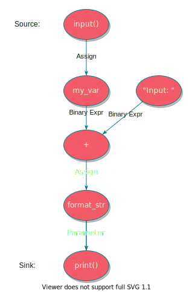

---
# Static Analysis Pipeline / Workflow

:memo: Code :heavy_check_mark: => :building_construction: Models :heavy_check_mark: => :speech_balloon: Patterns :mag: => :bookmark_tabs: Results!


*Rules and Queries*

---
# :zap: Taint Analysis

- Sources (user controlled inputs)
- Sinks (dangerous methods / assignments)
- Sanitizers (secures the user data)
- Passthroughs (functions that track tainted data)


---
# :speech_balloon: Patterns - :straight_ruler: Rules & :gear: Queries 

- Define a Security Pattern that you want to detect
  - :warning: SQL Injection, Cross site script, etc.

- All static code analysis tools has rules or/and queries
  - Hardcoded or Customisable
  - Open or Closed source

- Configuration Rules or Dynamic Queries

- *:confused: False Positives & False Negatives*

---
<!-- _footer: "All generally specking" -->
## Configuration Rules or Dynamic Queries

- :straight_ruler: Configuration Rules (yaml, json, data structure...)
  - Simpler to write
  - Complex flows can be very hard to declare

- :gear: Dynamic Queries (:hash: programming like language)
  - Harder to learn and write
  - Complex flows are easier

---
# Just use Regex!?

*Jamie Zawinski (early Netscape engineer):*

> Some people, when confronted with a problem, think "I know, I'll use regular expressions." Now they have two problems.

<!--
Sources:
- http://regex.info/blog/2006-09-15/247
- https://blog.codinghorror.com/regular-expressions-now-you-have-two-problems/
-->

---
#### Example - Detecting Simple Configuration Problems

```python
from flask import Flask, render_template

app = Flask("MyApp")

@app.route("/")
def index():
    return render_template("index.html")

if __name__ == "__main__":
    app.run("0.0.0.0", 80, debug=True)
```

*What issue do you see here?*

<!-- 
Simple debugging is enabled
-->

---
<!-- _footer: "Mokeup example rules language" -->
#### :straight_ruler: Configuration Rules - Basic Configuration Queries

```yaml
name: "Debugging Enabled"
sources:
  types: bool
  value: True

sinks:
  flask:
    - 'flask.Flask(){}.run([2]|debug)'
```

---
<!-- _footer: "Mokeup example query language" -->
### :gear: Dynamic Queries - Language for Querying

*Use the AST, CFG, and DFG to get results*

```python
from sca import ast, cfg, dfg, results

sources = ast.getType("bool").getValue("True")

flask = ast.findImport("flask").getExpr("Flask")
sinks = flask.getCall("run").getParameters("debug") or flask.getCall("run").getParameters(2)

results = dfg.taint(sources, sinks)
```

<!-- 
Generally runs in a sandbox
-->
---
#### Example - Simple Taint Flow

```python
from flask import Flask, request, render_template, make_response

# ...
@app.route("/search")
def search():
    query = request.args.get("s")
    results = lookup(query)

    if len(results) > 0:
        return render_template("search.html", results=results)
    else:
        return make_response("No results found for: " + query, 404)
```

*What issue do you see here?*

---
<!-- _footer: "Mokeup example rule language" -->
#### :straight_ruler: Configuration Rules - Data Flow Queries

```yml
name: "Cross Site Scripting"
sources:
  flask:
    - "flask.request.args[]"
    - "flask.request.args.get()"
sinks:
  flask:
    - "flask.make_response([0])"
    - "flask.Response([0]){}"
    - "flask.render_template_string([0])"
    - "flask.abort([2])"
```

<!--
Sources / Influence:
- https://github.com/returntocorp/semgrep-rules/blob/develop/python/flask/security/dangerous-template-string.yaml
-->
---
<!-- _footer: "Mokeup example query language" -->
### :gear: Dynamic Queries - Language for Querying

*Use the AST, CFG, and DFG to get results*

```python
from sca import ast, cfg, dfg, results

flask = ast.findImport("flask")
# `args.get('x')` or `args['x']`
sources = flask.getMember("request").getMember("args").getUses()  

routes = flask.findDecorator("route").getCall() # def search(...):
sinks = ast.getType("str").getExpr() & routes.getReturns()

results = dfg.taint(sources, sinks)
```

---
# Modeling

:building_construction: Models != Modeling

- Researching a framework, library, or module
  - `Flask`, `Django`, etc.

- Creating reuseable models for the Static Analyser
  - "User Inputs"
    - `flask.request.args[]`, etc.
  - "XSS Sinks"
    - `flask.make_response([0])`, etc.

---
<!-- _footer: "Mokeup example query language" -->
### Example - Modeling

```python
from sca import dfg, results
from sca.flask import flask_sources, flask_sinks_xss, flask_sanitizers_xss
# Or even easier...
from sca.web import web_sources, web_sinks_xss, sanitizers_xss

# XSS Query in a couple of lines
results = dfg.taint(web_sources, web_sinks_xss, sanitizers_xss)
```

---
# :no_entry: Sanitizers

- Functions or checks that cause the input to be securing used
  - Escaping or Encoding before the sink

- Context is extremely important
- Inline, Direct, and Indirect are... extremely complicated!


---
### Example - XSS but using Sanitizer

```python
from flask import Flask, request, render_template, escape
# ...
@app.route("/search")
def search():
    query = request.args.get("s")
    results = lookup(query)

    if len(results) > 0:
        return render_template("search.html", results=results)
    else:
        return "No results found for: " + escape(query)
```

*Rules don't work now... False Positives here we come*

---
### Example - Using another Sanitizer...

```python
from flask import Flask, request, render_template
from pymysql.converters import escape_string
# ...
@app.route("/search")
def search():
    query = request.args.get("s")
    results = lookup(query)

    if len(results) > 0:
        return render_template("search.html", results=results)
    else:
        return "No results found for: " + escape_string(query)
```

*Are we secure now?*

---
# Context is so important!

**But it's so hard to tools to know without us telling them**


---
# Example - Hashing

```python
import hashlib
# ...
def hashData(data: str) -> str:
    # using SHA1
    hashobj = hashlib.sha1(data.encode())
    digest = hashobj.hexdigest()
    return digest
# ...
```

**Is this insecure?**

---
# Answer: It Depends on context

**Any form of Cryptography (signing, integraty, etc), password storage**

*What about Git? OpenSSL? Simple file hashing signatures?*

---
# Example - Hashing attempt 2

```python
import hashlib
# ...
def hashData(data: str) -> str:
    # using SHA256 now...
    hashobj = hashlib.sha256(data.encode())
    digest = hashobj.hexdigest()
    return digest
# ...
```

**Is this insecure?**

---
# Answer: It Depends on context

**Password hashing!?**

```python
# ...
@app.route("/signin")
def signin():
  # ...
  password = request.form.get("password")
  digest = hashData(password)

```

**Use `PBKDF2` (NIST and FIPS-140 compliant) or hashing schema with high work factor**

<!--
Sources:
- https://cheatsheetseries.owasp.org/cheatsheets/Password_Storage_Cheat_Sheet.html
-->
---
#### Sanitizers - Inline, Direct, and Indirect

```python
# > inline
output = escape(input())

# > direct (secure function just checks for non-alpha/non-int chars)
if secure(output):
  output = input()
else:
  output = "Error, insecure value passed in"

# > indirect (validator)
if not secure(output):
  output = "Error, insecure value passed in"
  return output

output = input()
```

---
# :radioactive: Passthroughs

- Tracking data sent to and from libraries

- Different Static Analysis tool treat this differently
  - What do you assume?

- Tainted? Sanitized?
- Taint entire objects / classes?


<!--
Sources:
- https://docs3.sonarqube.org/latest/analysis/security_configuration/
-->
---
### Example - Passthroughs

```python
import os

name = input("Input: ")

# What does `join` do? Does it sanitizer? Does it return tainted data?
result = os.path.join("data", name)
```

---
## :bookmark_tabs: Results - Static Analysis Final Step

- :warning: Security Issues
  - SQL Injection, Cross Site Scripting, ...
- :sparkles: Best Practices
  - Using Key Vaults, ...
- :mag_right: Code Quality and Code Smells
  - Long Functions, Duplicated code, ...
- :thumbsup: Positive Results
  - Using appropriate hashing algorithms, automatic encoding, ...

---
# :tada: Congratulations: 
## Here not be Dragons :dragon:, Here be Security :closed_lock_with_key:

---
# Conclusion

:memo: Code => :building_construction: Models => :speech_balloon: Patterns => :bookmark_tabs: Results!

- :memo: Code (input)
- :building_construction: Models (:palm_tree: AST, :ocean: CFG, :compass: DFG)
- :speech_balloon: Patterns (:zap: Taint Analysis, Rules, and Queries)
- :bookmark_tabs: Results! (security vulnerabilities, code quality)

---
# :thumbsup: The Pros

- :running: Fast to run
- :avocado: Easy to Implement
- :wave: Developer friendly verses other security solutions
- :toolbox: Adding to SDLC process

---
# :thumbsdown: The Cons

- Poorly written tools leading to:
  - False Positives (not valid security issues)
  - False Negatives (un-discovered true findings)
- Generally not aware of context
- :eyes: Need to know all your sources, sinks, and Sanitizers
  - False Negatives
  - Every framework, library, and module 

---
# Thanks to...

- [@Sheldorr](https://twitter.com/Sheldorr) reviewing slides
- [@Hexploitable](https://twitter.com/Hexploitable) for the images

---
# Thanks you, any questions?

**https://presentations.geekmasher.dev/2021-10-HackSoc**

**https://github.com/GeekMasher/presentations**

*See slides and repo for references*


<!--
Sources:
- [How does JavaScript and JavaScript engine work in the browser and node?](https://medium.com/jspoint/how-javascript-works-in-browser-and-node-ab7d0d09ac2f)
- [Firing up the Ignition interpreter](https://v8.dev/blog/ignition-interpreter)
- [Carnegie Mellon University - Taint Analysis](https://www.cs.cmu.edu/~ckaestne/15313/2018/20181023-taint-analysis.pdf)
- [Northwestern - Static Analysis](https://users.cs.northwestern.edu/~ychen/classes/cs450-f16/lectures/10.10_Static%20Analysis.pdf)
- https://labs.f-secure.com/assets/BlogFiles/mwri-Static-Analysis-for-Code-and-Infrastructure-final-DevSecCon2016-2016-24-10.pdf
--->
