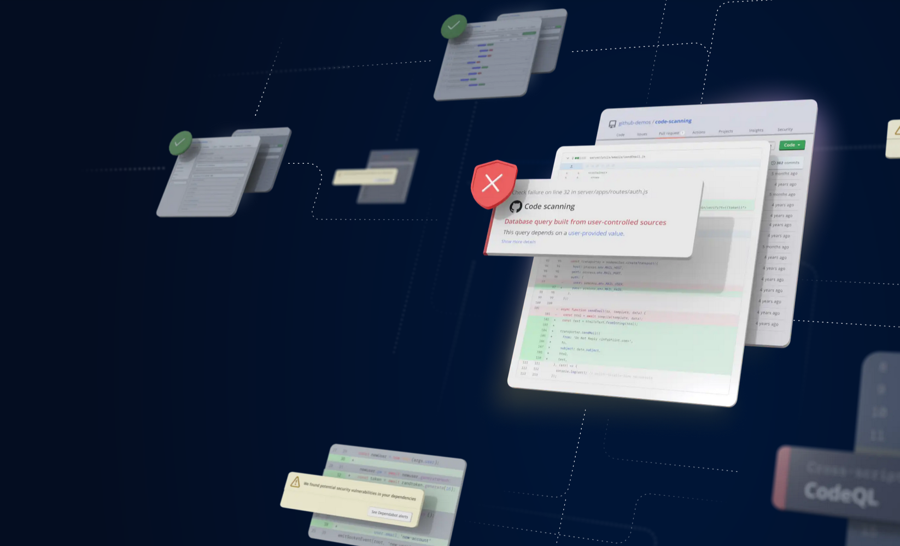
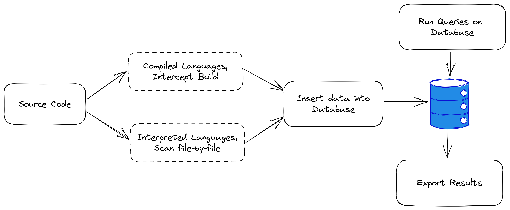
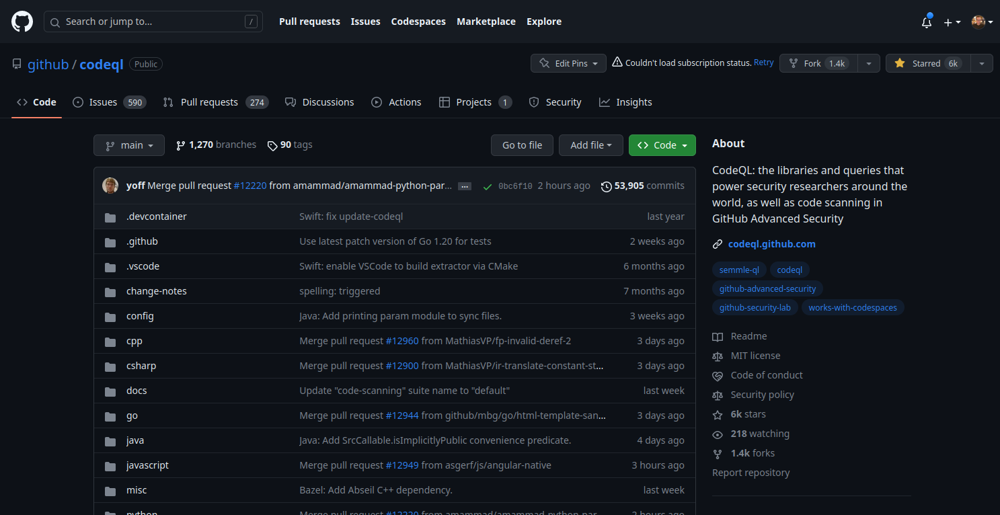

<!-- _footer: "v1.0" -->
# Introduction to CodeQL

**By Mathew Payne - @GeekMasher**



---

!include(./presentations/common/whoami.md)

---
# Today's Talk

- What is Static Code Analysis and CodeQL?
- Running CodeQL to do research
- Introduction to Query writing

*Questions during presentation are welcome!*

---
# :mag: Static Code Analysis Basics

*Poll Time*

---
# :mag: What is Static Code Analysis?

- :memo: An automated tool to analyse source code
  - "Asking and answering questions about the code"
- :lock: Static Application Security Testing (SAST)
- :hash: Looks at the code without running the code
- :mag: Discover security vulnerabilities
- :link: Perform Taint Tracking Analysis

<!-- 
- Data-flow, Control-flow, and SSA Graph's

Sources:
- https://owasp.org/www-community/controls/Static_Code_Analysis
-->

---
<!-- _footer: "Source: imgflip.com" -->
# Why Static Code Analysis?


---
# :zap: Taint Tracking Analysis

*Track data through an application*

- :mag: Sources (untrustworthy application inputs)
- :interrobang: Sinks (methods / assignments of interest)
- :lock: Sanitizers (secures the user data)
- :lock: Guards (conditional checks)
- :ghost: Passthroughs / Taintsteps (understand what an expression does)

---
# :zap: Example - Code Review

```python
from flask import Flask, request, render_template
# ...
@app.route("/search")
def search():
    search = request.args.get("search")
    results = lookup(search)
    return render_template(
        "search.html", results=results
    )

```

---
# :zap: Example - Code Review

```python
from flask import Flask, request, render_template
# ...
@app.route("/search")
def search():
    search = request.args.get("search")  # <- source, request parameter
    results = lookup(search)             # <- sink?
    return render_template(
        "search.html", results=results   # <- sink?
    )

```

---
# :zap: Example - Code Review

```python
from flask import Flask, request, render_template

def lookup(data):
    cursor = conn.cursor()
    query = f"SELECT * FROM metadata WHERE name='{data}' OR data='{data}'"
    
    cursor.execute(query)
    return cursor.fetchall()

@app.route("/search")
def search():
    search = request.args.get("search")
    results = lookup(search)
    # ...
```
---
# :zap: Example - Taint Tracking Analysis

```python
from flask import Flask, request, render_template

def lookup(data):   # <- 3. function definition
    cursor = conn.cursor()
    query = f"SELECT * FROM metadata WHERE name='{data}' OR data='{data}'"
    # ^ 4. string format, tainting query
    cursor.execute(query)    # <- 5. SINK!
    return cursor.fetchall()

@app.route("/search")
def search():
    search = request.args.get("search")  # <- 1. source, request parameter
    results = lookup(search)             # <- 2. function call
    # ...
```

---
# :zap: Example - Code Review (2nd sink)

```python
from flask import Flask, request, render_template
# ...
@app.route("/search")
def search():
    search = request.args.get("search")
    results = lookup(search)
    return render_template(
        "search.html", results=results   # <- sink?
    )

```

---
<!-- _footer: "Source: flask.palletsprojects.com" -->
# :zap: Researching Framework/Library

**HTML Escaping / Jinja Templates**

> When returning HTML (the default response type in Flask), any user-provided values rendered in the output must be escaped to protect from injection attacks. HTML templates rendered with Jinja, introduced later, will do this automatically.

---
# :mag: CodeQL :lock:


---
# Disclaimer Time :sweat_smile:


---
# What is CodeQL?

- :wrench: Static Code Analysis Engine
- :books: Extracts source code into data
- :arrow_heading_down: Stores data in a Database
- :mag: Queries run on the Database
- :symbols: Domain-specific language called "QL"


---
# CodeQL Pipeline



*Code -> Database -> Queries -> Results*

---
<!-- _footer: "Source: github.com/github/codeql" -->



---
# Getting Started

- [VSCode CodeQL Starter](https://github.com/github/vscode-codeql-starter)
- [Insecure Code](https://gist.github.com/GeekMasher/57758192602a045870eb007dcfd35cbb)

```bash
# vscode starter
git clone --depth=1 https://github.com/github/vscode-codeql-starter

# create database (codeql cli)
codeql database create --language python ./python-DC44131-workshop
```

*note: a little different for compiled languages*

---
<!-- _footer: "Source: codeql.github.com/docs/writing-codeql-queries/codeql-queries" -->
### :mag: CodeQL Query Basics


```codeql
/** 
 * @name SQL Injection
 * @kind problem
 * ...
 */
import python
import DataFlow::PathGraph

// Predicates and Classes
class Sources extends DataFlow::Node { /* class  */ }

// Query Output / Results
from Call call
select call, "Calls in the code"
```

---
# Let's Answer Some Questions...


---
# Question 1

### How do we find the Source?

---
# Python Code

```python 
from flask import request

request.args.get("search")
# ^ Source!
```

---
# CodeQL Query

```codeql
import python
import semmle.python.Concepts
import semmle.python.ApiGraphs

/*
 * How do we find the source?
 */

from DataFlow::Node request, Attribute attr
where
  request = API::moduleImport("flask").getMember("request").getAValueReachableFromSource() and
  attr.getObject() = request.asExpr()
select attr, "Source"
```

---
# Question 2

### What is the Sink?

---
# Python Code

```python 
import psycopg2

conn = psycopg2.connect("dbname=workshop user=postgres")

cursor = conn.cursor()
cursor.execute(query)
     # ^ Sink: execute(query)
```

---

```codeql
import python
import semmle.python.Concepts
import semmle.python.ApiGraphs

/*
 * What is the sink?
 */

from CallNode call, DataFlow::Node sink
where
  // Find all functions called "execute"
  call.getFunction().(AttrNode).getName() in ["execute"] and
  // The first argument is what we are interested in
  sink.asCfgNode() = call.getArg(0)
select sink, "Sink"
```

*Note: being lazy and looking for `execute(...)`*

---
# Question 3

### Can we find a path from Source to Sink?

---
# CodeQL Full - Complete

```codeql
class SqlInjectionConfig extends TaintTracking::Configuration {
  SqlInjectionConfig() { this = "SqlInjectionConfig" }

  override predicate isSource(DataFlow::Node source) { source instanceof Sources }

  override predicate isSink(DataFlow::Node sink) { sink instanceof Sinks }
}

from SqlInjectionConfig config, DataFlow::PathNode source, DataFlow::PathNode sink
where config.hasFlowPath(source, sink)
select sink.getNode(), source, sink, "This SQL query depends on $@.", source.getNode(),
  "a user-provided value"
```

--- 
# CodeQL Queries and Databases


- :octopus: Pre-computed Databases
  - Databases for most Open Source applications
- :cat: Using built-in queries
  - There are hundreds of queries per-language
  - Fully extendable and customisable

---
# Closing Words


- :mag: Powerful tool to find security vulnerabilities
- :muscle: Does the heavy lifting for us
- :cold_sweat: SDL is complex to learn, but once you do :eyes:! 
- :astonished: Find 0-day using CodeQL

---
# Questions?


---
# Happy Bug Hunting :moneybag:!


- [Slides]
- [Code]
- [CodeQL Docs]


<!-- Resources -->
[Code]: https://gist.github.com/GeekMasher/ce1a06adf9b004baf63fdc59d979c783
[Slides]: https://presentations.geekmasher.dev/2023-05-Defcon44131

<!-- CodeQL -->
[GitHub Advanced Security]: https://github.com/features/security
[CodeQL Docs]: https://codeql.github.com

<!-- Memes -->
[meme-source-code]: https://imgflip.com/memegenerator/Always-Has-Been

