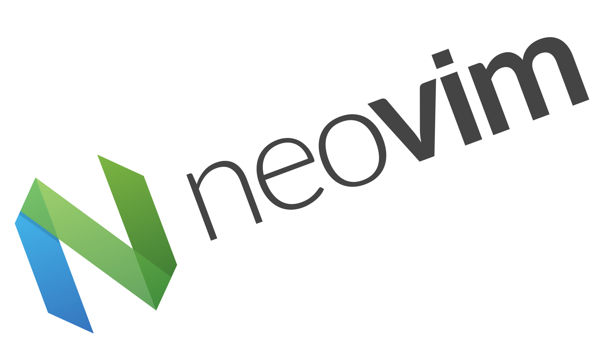

<!-- _footer: "v1.0" -->

# Using Neovim to Help Develop Secure Code

**NeovimConf 2023**

<!--  -->

---

<!-- _class: -->

# # Whoami

**Mathew Payne - @GeekMasher**

Princial Field Security Specialist at GitHub

_Focus on:_

- :computer: Static Code Analysis
- :eyes: Code Review & Automatic Security Testing
- :handshake: DevOps / DevSecOps

---

# Lets Talk about Security Tools

- Traditionally
  - Strapped to the end of development
  - Code written weeks/months ago is now being flagged
- Shifting Security Left
  - Briging security tools into the hands of developers
  - IDEs and Pull / Merge Requests

---

# My Areas of Interest

**Two main types of tools we are going to focus on:**

- Dependency Analysis
- Static Code Analysis

<!--
- Software Composition Analysis (SCA)
- Static Application Security Testing (SAST)
-->

---

# Introducing DevSecInspect.nvim

- Bring security tools into Neovim
- Lua based Neovim plugin
- Uses open-source tools to help you write secure code

---

# Dependency Analysis

- Identify in-secure dependencies
- Find any dependencies that have known issues
- Automatically provide a fix if possible

---

# Static Code Analysis

- Indetify insecure code written in your application
- Direct feedback in Neovim
- Challenges
  - Speed versus Accuracy

---

# Thank you!

- Checkout DevSecInspect

  - https://github.com/GeekMasher/DevSecInspect.nvim

- Socials

  - @GeekMasher on Twitter / Mastodon
  - Blog - https://geekmasher.dev
  - YT Channel - https://www.youtube.com/@GeekMasher
